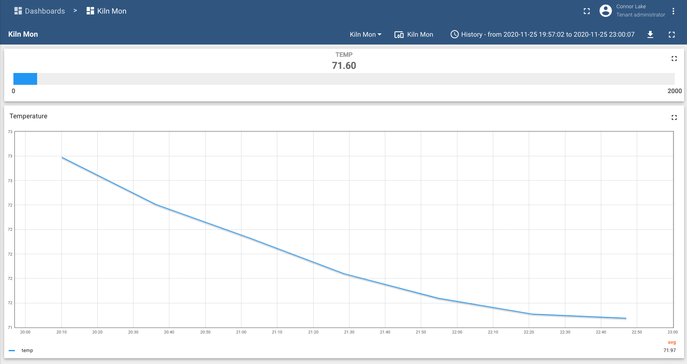
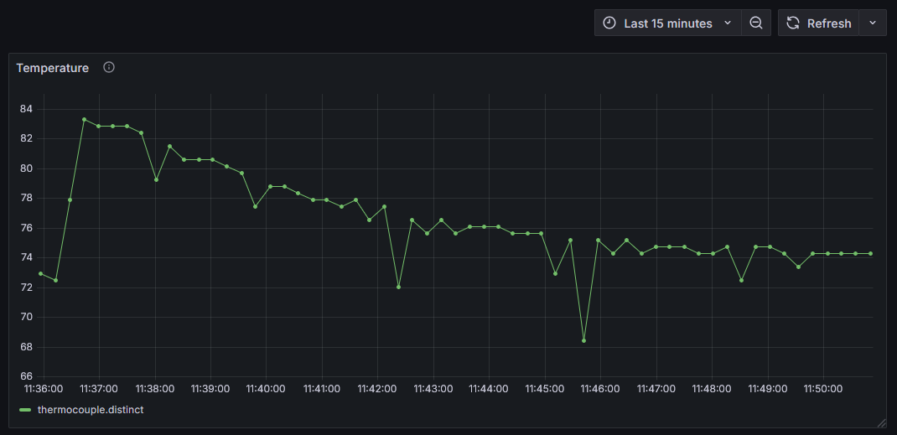
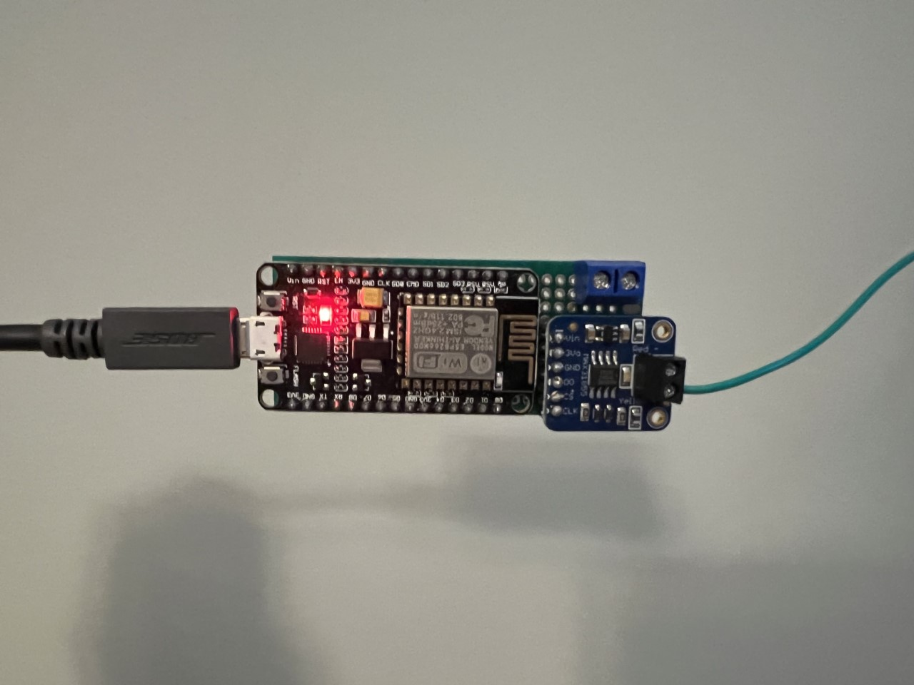
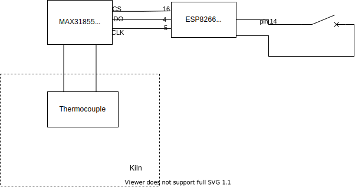

# Kiln Mon

This project is used to help monitor a Skutt 818 manual kiln. It uses a `esp8266` wifi chip as a microcontroller.

It performs the following functionality

- Kiln Temperature monitoring
  - Using a MAX31855 thermocouple amplifier (with thermocouple)

## Dashboards for monitoring

**ThingsBoard:**



**Grafana:**



## Photo of device



## Schematic




## Quick setup:

### How to build

This project uses platformio for simple compiling, building, and monitoring with the pcb board. Download the vscode extension for [platformio](https://platformio.org/)

### Credential files

You will need two credential files: `upload_creds.h` and `wifi_creds.h` within the `/src` directory. They will provide the credentials for wifi connections, uploads to third parties etc...

Here are some example stubs to copy and make them with:
```bash
// upload_creds.h
#define UPLOAD_TCP_SERVER "placeholder"
#define UPLOAD_TCP_PORT 1111
#define ACCESS_TOKEN "placeholder"
#define UPLOAD_R620_SERVER "placeholder"
#define UPLOAD_R620_PORT 1111
#define INFLUX_DB_API_TOKEN "placeholder"
```


```bash
// wifi_creds.h
#define WIFI_AP "placeholder"
#define WIFI_PASSWORD "placeholder"
```
